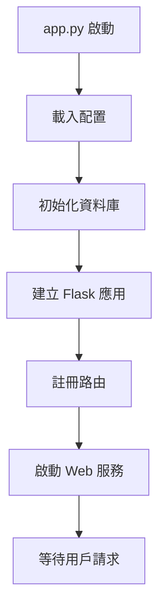
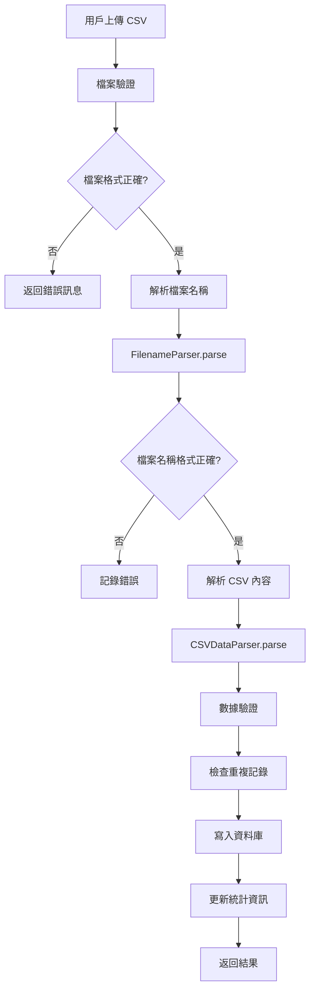
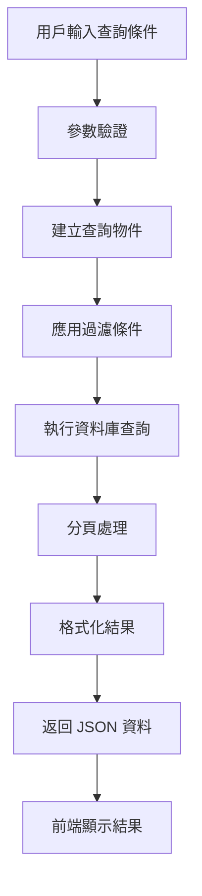

# CSV 數據分析與管理系統

一個專業的測試數據管理平台，支援 CSV 檔案匯入、數據查詢、統計分析等功能。

## 專案結構

```
csv_analysis_system/
├── README.md                    # 專案說明文件
├── requirements.txt             # Python 依賴套件
├── app.py                      # Flask 主應用程式
├── models.py                   # 資料庫模型定義
├── csv_parser.py               # CSV 解析模組
├── data_service.py             # 數據服務層
├── config.py                   # 配置檔案
├── run.py                      # 應用啟動腳本
├── data/                       # 資料庫檔案目錄
│   └── test_records.db         # SQLite 資料庫檔案
├── uploads/                    # 檔案上傳暫存目錄
├── templates/                  # HTML 模板
│   ├── base.html              # 基礎模板
│   ├── index.html             # 首頁
│   ├── import.html            # 匯入頁面
│   ├── search.html            # 搜尋頁面
│   ├── analysis.html          # 分析頁面
│   └── error.html             # 錯誤頁面
├── static/                     # 靜態檔案
│   ├── css/
│   ├── js/
│   └── images/
├── tests/                      # 測試檔案
│   ├── test_models.py
│   ├── test_parser.py
│   ├── test_service.py
│   └── test_api.py
└── logs/                       # 記錄檔目錄
```

## 系統架構

### 技術棧
- **後端**: Python 3.8+, Flask, SQLAlchemy
- **資料庫**: SQLite (可擴展至 PostgreSQL/MySQL)
- **前端**: Bootstrap 5, Chart.js, Vanilla JavaScript
- **數據處理**: Pandas, NumPy

### 架構設計原則
- **模組化設計**: 各功能獨立模組，低耦合高內聚
- **分層架構**: 資料層、服務層、控制層、展示層分離
- **單一職責**: 每個模組只負責特定功能
- **可擴展性**: 支援水平擴展和功能擴展

## 快速開始

### 1. 環境需求
- Python 3.8 或更高版本
- pip 套件管理器
- 8GB 以上記憶體 (建議)

### 2. 安裝步驟

```bash
# 1. 克隆專案 (或下載所有檔案)
mkdir csv_analysis_system
cd csv_analysis_system

# 2. 建立虛擬環境
python -m venv venv

# 3. 啟動虛擬環境
# Windows:
venv\Scripts\activate
# macOS/Linux:
source venv/bin/activate

# 4. 安裝依賴套件
pip install -r requirements.txt

# 5. 建立必要目錄
mkdir data uploads logs static/css static/js static/images

# 6. 初始化資料庫
python -c "from models import init_database; init_database()"

# 7. 啟動應用
python app.py
```

### 3. 瀏覽器訪問
開啟瀏覽器，訪問 `http://localhost:5000`

## 配置說明

### 環境變數配置 (.env 檔案)
```env
# 資料庫配置
DATABASE_URL=sqlite:///data/test_records.db

# Flask 配置
FLASK_ENV=development
SECRET_KEY=your-secret-key-here

# 檔案上傳配置
MAX_CONTENT_LENGTH=16777216  # 16MB
UPLOAD_FOLDER=uploads

# 日誌配置
LOG_LEVEL=INFO
LOG_FILE=logs/app.log
```

## 程式流程說明

### 1. 系統啟動流程



### 2. CSV 匯入流程



### 3. 數據查詢流程



### 4. 核心模組說明

#### models.py - 資料模型層
- **TestRecord**: 測試記錄主表
- **ImportLog**: 匯入記錄表
- **DatabaseManager**: 資料庫管理器 (單例模式)

#### csv_parser.py - 解析處理層
- **FilenameParser**: 檔案名稱解析器
- **CSVDataParser**: CSV 內容解析器
- **DataValidator**: 數據驗證器

#### data_service.py - 業務邏輯層
- **DatabaseService**: 資料庫操作服務
- **ImportService**: 匯入處理服務
- **QueryService**: 查詢分析服務

#### app.py - 控制展示層
- **路由處理**: Web 請求路由
- **API 接口**: RESTful API
- **錯誤處理**: 統一錯誤處理

## 檔案名稱格式規範

系統支援的檔案名稱格式：
```
SN_YYYYMMDD_HHMMSS_(left/right/rec1/rec2)

範例：
32120121ED0755130005_20250522_084534_left
```

### 格式說明：
- **SN**: 設備序號 (字母數字組合)
- **YYYYMMDD**: 測試日期 (8位數字)
- **HHMMSS**: 測試時間 (6位數字)  
- **測試項目**: left/right/rec1/rec2

## 資料庫設計

### 主要資料表

#### test_records (測試記錄表)
- **主鍵**: id (自增)
- **唯一約束**: sn + test_date + test_time + test_type
- **索引**: sn, test_date, test_type, import_time
- **頻率欄位**: freq_100 ~ freq_2000 (支援多種測試頻率)

#### import_logs (匯入記錄表)
- **追蹤匯入過程**: 成功/失敗/重複統計
- **錯誤記錄**: 詳細錯誤訊息
- **性能監控**: 匯入時間記錄

## API 接口說明

### 主要 API 端點

| 端點 | 方法 | 功能 | 參數 |
|------|------|------|------|
| `/api/upload` | POST | 上傳 CSV 檔案 | file, encoding |
| `/api/search` | GET | 搜尋記錄 | sn, test_date, test_type, page |
| `/api/sn/<sn>` | GET | 獲取 SN 所有記錄 | - |
| `/api/analysis/frequency` | GET | 頻率分析 | sn, frequency |
| `/api/analysis/compare` | GET | SN 比較 | sn1, sn2, frequency |
| `/api/statistics` | GET | 統計資訊 | - |
| `/api/import-history` | GET | 匯入歷史 | limit |

### 回應格式
```json
{
    "success": true,
    "message": "操作成功",
    "data": {...},
    "pagination": {...}  // 分頁資訊
}
```

## 部署說明

### 開發環境
```bash
python app.py
```

### 生產環境
```bash
# 使用 Gunicorn
gunicorn -w 4 -b 0.0.0.0:8000 app:app

# 使用 Docker (可選)
docker build -t csv-analysis .
docker run -p 8000:8000 csv-analysis
```

### Nginx 配置 (可選)
```nginx
server {
    listen 80;
    server_name your-domain.com;
    
    location / {
        proxy_pass http://127.0.0.1:8000;
        proxy_set_header Host $host;
        proxy_set_header X-Real-IP $remote_addr;
    }
    
    location /static {
        alias /path/to/csv_analysis_system/static;
    }
}
```

## 測試說明

### 執行測試
```bash
# 執行所有測試
pytest

# 執行特定測試
pytest tests/test_models.py

# 生成覆蓋率報告
pytest --cov=. --cov-report=html
```

### 測試數據
在 `tests/` 目錄下準備測試用的 CSV 檔案：
- `test_data_valid.csv`: 正確格式的測試數據
- `test_data_invalid.csv`: 錯誤格式的測試數據

## 維護與監控

### 日誌檔案
- **應用日誌**: `logs/app.log`
- **錯誤日誌**: `logs/error.log`
- **匯入記錄**: 資料庫 import_logs 表

### 性能監控
- 監控資料庫檔案大小
- 檢查記憶體使用量
- 監控 API 回應時間

### 備份策略
```bash
# 備份資料庫
cp data/test_records.db backup/test_records_$(date +%Y%m%d).db

# 備份上傳檔案
tar -czf backup/uploads_$(date +%Y%m%d).tar.gz uploads/
```

## 故障排除

### 常見問題

1. **資料庫連接失敗**
   - 檢查 `data/` 目錄權限
   - 確認 SQLite 檔案存在

2. **CSV 解析失敗**
   - 檢查檔案名稱格式
   - 確認檔案編碼 (UTF-8)

3. **記憶體不足**
   - 分批處理大型 CSV 檔案
   - 增加系統記憶體

4. **Web 介面無法訪問**
   - 檢查防火牆設定
   - 確認 Flask 應用正常啟動

## 擴展功能

### 已實現功能
- ✅ CSV 檔案匯入
- ✅ 數據搜尋與過濾
- ✅ 統計分析
- ✅ Web 介面
- ✅ API 接口

### 可擴展功能
- 📋 數據導出 (Excel, PDF)
- 📋 進階圖表分析
- 📋 用戶權限管理
- 📋 自動化報告生成
- 📋 數據備份與恢復
- 📋 分散式部署支援

## 技術支援

如有問題，請檢查：
1. Python 版本是否正確
2. 依賴套件是否完整安裝
3. 資料庫是否正確初始化
4. 檔案權限是否正確設定

## 授權條款

本專案採用 MIT 授權條款，詳見 LICENSE 檔案。